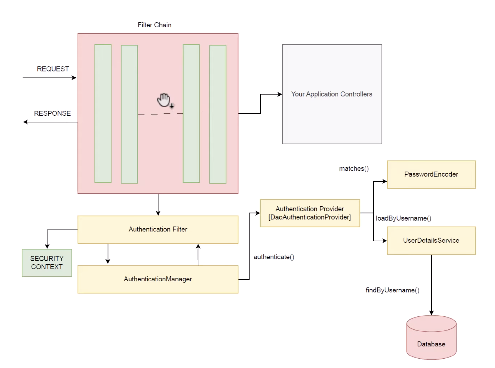

## Big idea: what “security” means in apps

* Security is explained using a **house analogy**:

    * Your house has doors/windows; you lock them to prevent unwanted access.
    * A web app is similar: security ensures only the right people can access the right parts, keeping data safe.

## Why security matters (4 reasons)

1. **Privacy protection**: prevent unauthorized viewing of personal/user data (reduces fraud/identity theft).
2. **Trust**: insecure apps lose user/client confidence.
3. **Integrity**: prevent unauthorized modification of data (keeping it correct/trustworthy).
4. **Compliance**: meet legal/regulatory requirements for data protection and avoid consequences.

## Where Spring Security fits in Spring

* They describe the “Spring ecosystem” as layers:

    * **Spring Framework** = foundation/structure
    * **Spring Boot** = makes setup easy (auto-config, ready-to-run)
    * **Spring Data** = data access
    * **Spring Security** = the security layer that protects your application and data

## The most important concept: Authentication vs Authorization

They emphasize people confuse these, so they clarify:

### Authentication = “Who are you?”

* Proving identity (username/password, fingerprint, membership card, etc.)
* Example: logging in proves you are user A.

### Authorization = “What are you allowed to do?”

* Permissions after login
* Example: user A logs in, but **may not** be allowed to delete records; admin can do more; support staff can do limited actions.

## Key security principles they want you to remember

* **Least privilege**: give users/processes only the minimum permissions needed.
* **Secure by design**: build security into the system from the start (not as an afterthought).
* **Fail-safe defaults**: secure out-of-the-box behavior by default.
* **Secure communication**: encrypt data in transit; prevent interception.
* **Input validation**: validate external input to prevent attacks (e.g., SQL injection).
* **Auditing & logging**: record security-relevant actions (who did what, when) to investigate incidents.
* **Regular updates & patch management**: keep dependencies/frameworks updated because patches fix vulnerabilities.

## What the rest of the series will cover (as teased)

* How Spring Security works + getting started
* **Form-based auth**
* **Basic auth**
* **JWT** (they said “GWT” in the transcript, but context strongly suggests JWT)
* **In-memory authentication**
* **Database authentication**

Here’s the summary of this video (based on the transcript you provided):

## What the video is trying to teach

The creator explains **how Spring Security works internally**—the main components and the **request flow**—so Spring Security doesn’t feel like “magic.” The focus is the **filter chain + authentication pipeline**.

## Core mental model: Request → Filter Chain → Controller

* In a normal Spring Boot app, a request would go toward your **controllers**.
* With Spring Security enabled, **every incoming request first passes through a chain of filters** (“filter chain”).
* These filters run **before** your controller logic and can block/allow requests.

## Key component: Authentication Filter

* One of the Spring Security filters is the **Authentication Filter**.
* Its job: intercept **login/authentication requests** (requests containing username/password or other credentials).
* It extracts credentials and builds an **Authentication object** (a container for credentials).
  
## Authentication object is the “currency” of Spring Security

* The video emphasizes: Spring Security passes identity information around as an **Authentication object**.
* The object starts “partial” (just submitted credentials), then becomes “fully authenticated” (with roles/authorities attached).

## Authentication Manager: the delegator

* The Authentication Filter hands the Authentication object to the **AuthenticationManager**.
* AuthenticationManager doesn’t usually validate itself—it **delegates** to an **AuthenticationProvider**.

## Authentication Provider: the validator

* **AuthenticationProvider** checks if the credentials are correct.
* To do this, it typically uses:

    1. **UserDetailsService**

        * Loads user info by username (e.g., username, stored password, roles/authorities) from a data source (commonly a database).
        * Returns a **UserDetails** object.
    2. **PasswordEncoder**

        * Encodes/compares the raw submitted password with the stored encoded password.
        * Helps the provider confirm if passwords match.

## Success path: Populate SecurityContext

If authentication succeeds:

* AuthenticationProvider returns a **fully populated Authentication object** (now includes roles/authorities).
* That Authentication object returns back up the chain:

    * Provider → AuthenticationManager → AuthenticationFilter
* Then Spring sets it into the **SecurityContext**.

    * The SecurityContext holds authentication info **for the duration of the request** (and typically across requests via session/token-based strategies, though the transcript mainly frames it as request duration).
* After that, the request continues to the **controller**, and authorization decisions can use the roles from the Authentication object.

## Providers vary based on where users come from

The video notes **different AuthenticationProviders** exist depending on your user store:

* **DaoAuthenticationProvider** (common for database-backed users)
* **In-memory provider**
* **LDAP provider**
* **JDBC provider**
  …and you choose based on where your user details are stored.

## Main takeaway

Spring Security works like a pipeline:
**Request → Security Filter Chain → AuthenticationFilter → AuthenticationManager → AuthenticationProvider → (UserDetailsService + PasswordEncoder) → authenticated Authentication → SecurityContext → Controller**

If you want, paste what framework the next video uses (basic auth? form login? JWT?) and I’ll translate this flow into “what code/config maps to each box” (e.g., where you define SecurityFilterChain, how UserDetailsService is wired, where PasswordEncoder lives, etc.).
