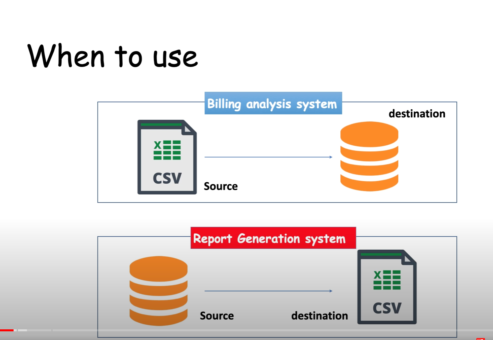
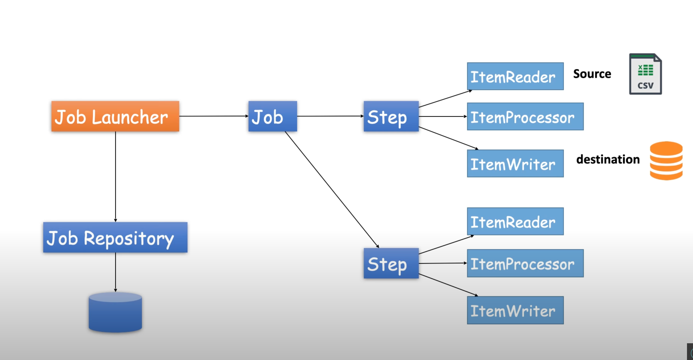

# Getting Started

spring batch is one of the core module of spring framework and using this spring batch you can create robust batch processing system
Batch processing is a technique which processes data in a large group instead of a single element of data. where you can process a high volume of data with minimal human interaction

